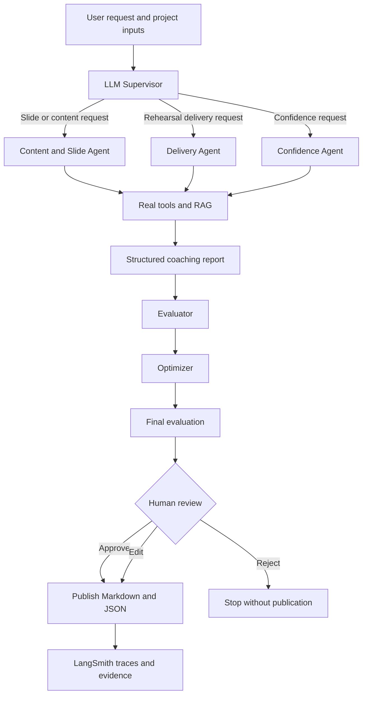

شغلك وتوثيقك للمشروع ممتاز جداً ومرتب! تم تحديث الملف وإزالة جميع الإشارات الخاصة بأكاديمية سدايا (SDAIA Academy) والمشرف وأسماء الطالبات، مع إبقاء المشروع باسمك وشخصك فقط:

---

---

---

## Project Information

| Item | Details |
| --- | --- |
| **Project** | Talaqa AI — Multi-Agent Presentation & Public-Speaking Coach |
| **Repository** | `Building-Agentic-AI-Systems-Talaqa-AI` |
| **Architecture Track** | Supervisor + Specialist Workers |
| **Workflow Pattern** | Evaluator–Optimizer |
| **Core Architecture** | Multi-Agent System + Hybrid RAG + Human-in-the-Loop |

## Table of Contents

* [Project Information](https://www.google.com/search?q=%23project-information)
* [Overview](https://www.google.com/search?q=%23overview)
* [Problem and Solution](https://www.google.com/search?q=%23problem-and-solution)
* [Key Capabilities](https://www.google.com/search?q=%23key-capabilities)
* [System Architecture](https://www.google.com/search?q=%23system-architecture)
* [Agents and Tools](https://www.google.com/search?q=%23agents-and-tools)
* [RAG Pipeline](https://www.google.com/search?q=%23rag-pipeline)
* [State, Memory, and Reliability](https://www.google.com/search?q=%23state-memory-and-reliability)
* [Repository Structure](https://www.google.com/search?q=%23repository-structure)
* [Setup and Run](https://www.google.com/search?q=%23setup-and-run)
* [Expected Demonstration Flow](https://www.google.com/search?q=%23expected-demonstration-flow)
* [Security and Responsible Use](https://www.google.com/search?q=%23security-and-responsible-use)
* [Limitations](https://www.google.com/search?q=%23limitations)

## Overview

Talaqa AI is a multi-agent coaching system that helps learners prepare presentations and rehearse public speaking. An LLM supervisor understands the request and routes it to a specialist agent. The selected agent uses real tools to retrieve curated guidance, inspect presentation files, analyze rehearsal transcripts, calculate speaking metrics, or generate a PowerPoint deck.

The system then structures the evidence into a validated coaching report, evaluates its quality, improves it through an Evaluator–Optimizer loop, and pauses for human approval before publishing the final report.

## Problem and Solution

### The problem

Many learners know their subject but still struggle with:

* organizing ideas into a clear presentation;
* designing readable, focused slides;
* controlling speaking pace and filler words;
* managing presentation anxiety and shyness;
* turning generic feedback into practical improvement steps.

### The solution

Talaqa AI combines measurable rehearsal evidence, curated public-speaking knowledge, specialized agents, learner memory, structured evaluation, and human review. Its recommendations are specific, evidence-grounded, and personalized instead of relying on generic advice such as “practice more.”

## Key Capabilities

* LLM-based supervisor routing with validated Pydantic output.
* Three specialist workers with different responsibilities and tool sets.
* Real model-selected tool calls rather than hard-coded tool execution.
* Complete RAG pipeline over a curated PDF knowledge base.
* Slide-deck analysis and PowerPoint generation.
* Transcript-based words-per-minute and filler-word measurement.
* Confidence-building and gradual exposure practice plans.
* Short-term thread state and long-term learner memory across threads.
* Evaluator–Optimizer quality-improvement loop.
* Human approval, editing, or rejection before publication.
* LangSmith tracing for real workflow observability.
* Rate limiting for reliable execution with Gemini API quotas.
* Published Markdown and JSON coaching-report artifacts.

## System Architecture

Talaqa AI follows a **Supervisor + Specialist Workers** architecture and applies an **Evaluator–Optimizer** workflow pattern.



LangGraph's Functional API coordinates routing, tool-using workers, state, memory, retry policies, interrupts, evaluation, optimization, and publication.

## Agents and Tools

| Agent | Main responsibility | Available tools |
| --- | --- | --- |
| **LLM Supervisor** | Select the best specialist for each request | Structured `RouteDecision` |
| **Content and Slide Agent** | Analyze slide structure or create a deck | RAG retrieval, PPTX/PDF inspection, PowerPoint generation |
| **Delivery Agent** | Analyze transcript-based delivery evidence | RAG retrieval, transcript reader, WPM and filler-word analysis |
| **Confidence Agent** | Build a gradual confidence-practice plan | RAG retrieval from confidence and public-speaking guides |
| **Evaluator** | Score grounding, specificity, and actionability | Structured `ReportEvaluation` |
| **Optimizer** | Revise the draft using evaluator feedback | Structured `CoachingReport` |

### Real tool evidence

The notebook prints each model-selected tool call, its arguments, and its output. This provides execution evidence that the agents actively use tools instead of only describing what they would do.

## RAG Pipeline

The project implements a complete, testable RAG pipeline:

1. Load the curated PDF knowledge base.
2. Extract text and retain source metadata.
3. Split documents into genuine overlapping chunks.
4. Create sentence-transformer embeddings.
5. Store vectors in a FAISS index.
6. Retrieve the most relevant chunks for each coaching query.
7. Pass grounded context and source filenames to the specialist agents.

The knowledge base covers presentation structure, slide design, voice delivery, body language, confidence and anxiety, public speaking, and a presentation rubric.

## State, Memory, and Reliability

### State and memory

* `InMemorySaver` maintains thread-level state and supports pause/resume.
* `thread_id` identifies each interaction thread.
* `InMemoryStore` saves learner preferences independently across threads.
* The notebook verifies both same-thread state and cross-thread memory.

### Reliability strategies

1. **Transient errors:** LLM tasks use LangGraph `RetryPolicy(max_attempts=3)`.
2. **Rate limits:** a shared `InMemoryRateLimiter` spaces Gemini requests.
3. **User-fixable errors:** missing transcript or duration data triggers `interrupt()` and accepts corrected input on resume.
4. **LLM-recoverable quality gaps:** evaluator feedback is passed to the optimizer for revision.
5. **Unexpected errors:** unexpected failures surface honestly instead of being hidden by a generic fallback.
6. **Human control:** the final report cannot be published until a reviewer approves or edits it.

## Repository Structure

```text
Building-Agentic-AI-Systems-Talaqa-AI/
├── Talaqa_AI_Capstone.ipynb       # Complete executable Colab notebook
├── SpeakUp_Knowledge_Base.zip      # Upload-ready curated knowledge base
├── README.md                       # Project documentation
├── requirements.txt                # Python dependencies
├── SUBMISSION_CHECKLIST.md         # Final verification checklist
├── .env.example                    # Secret-name template only
├── .gitignore                      # Prevents accidental secret/output commits
├── data/
│   └── rehearsal_transcript.txt    # Sample rehearsal transcript
├── knowledge_base/
│   ├── body_language_guide.pdf
│   ├── confidence_and_anxiety.pdf
│   ├── presentation_rubric.pdf
│   ├── presentation_structure.pdf
│   ├── public_speaking_guide.pdf
│   ├── slide_design_guide.pdf
│   └── voice_delivery_guide.pdf
├── docs/
│   └── architecture.md
├── evidence/
│   └── README.md
└── outputs/
    └── README.md

```

## Setup and Run

### Prerequisites

* A Google account with access to Google Colab.
* A Gemini API key from Google AI Studio.
* A LangSmith API key.
* The two upload files included in this repository:
* `SpeakUp_Knowledge_Base.zip`
* `data/rehearsal_transcript.txt`


### Google Colab

1. Open `Talaqa_AI_Capstone.ipynb` in Google Colab.
2. Open **Secrets** from the key icon in the left sidebar.
3. Add `GEMINI_API_KEY`, paste the Gemini key, and enable notebook access.
4. Add `LANGSMITH_API_KEY`, paste the LangSmith key, and enable notebook access.
5. Set `ACTUAL_DURATION_MINUTES` to the real stopwatch duration represented by the transcript.
6. Select **Runtime → Restart session**.
7. Select **Run all** once.
8. When prompted, upload `SpeakUp_Knowledge_Base.zip` and `rehearsal_transcript.txt` together.
9. Allow the notebook several minutes to finish because Gemini requests are intentionally rate-limited.
10. Confirm that all evidence checks pass and no cell ends with an exception.
11. Save or download the executed `.ipynb` file with its outputs.

> Do not place API keys directly in notebook cells, `.env.example`, the README, or Git history.

### Local environment

To run in a local Python environment:

```bash
python -m venv .venv
source .venv/bin/activate       # Windows: .venv\Scripts\activate
pip install -r requirements.txt

```

Set the required keys through environment variables or a secrets manager before adapting the Colab-specific upload and secret-loading cells.

## Expected Demonstration Flow

A successful top-to-bottom run demonstrates:

1. Secrets and LangSmith configuration load successfully.
2. The knowledge base is extracted and converted into a FAISS RAG index.
3. Retrieval returns relevant source chunks.
4. The LLM routes different requests to appropriate specialists.
5. Same-thread and cross-thread memory tests pass.
6. A missing-input example pauses and resumes correctly.
7. The full agent run selects real tools and produces measured transcript evidence.
8. The Evaluator–Optimizer loop prints initial and final evaluations.
9. The workflow pauses before publication for human review.
10. Approval resumes the workflow and publishes Markdown and JSON reports.
11. LangSmith prints real trace insights.
12. The automated verification summary confirms all pipeline requirements pass.

## Security and Responsible Use

* API keys are loaded from Colab Secrets and must never be committed.
* `.gitignore` excludes common secret files and generated output artifacts.
* Transcript analysis is limited to text evidence; the system does not claim to hear audio or see body language.
* Human approval is required before publishing the final coaching report.
* Confidence guidance is educational and is not a medical or psychological diagnosis.

## Limitations

* Text transcripts cannot measure tone, volume, pronunciation, facial expressions, or body language.
* Words per minute are accurate only when the real recording duration is supplied.
* In-memory state is suitable for the current implementation; production deployment should use durable database-backed persistence.
* FAISS is rebuilt during execution rather than hosted as a persistent service.
* Model quality and availability depend on the selected Gemini model and API quota.
* The included knowledge base provides general coaching guidance and does not replace professional care.
